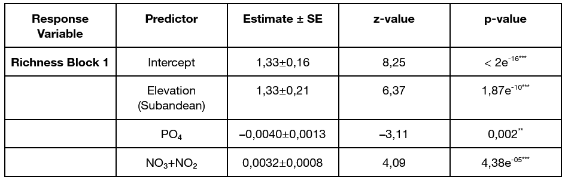
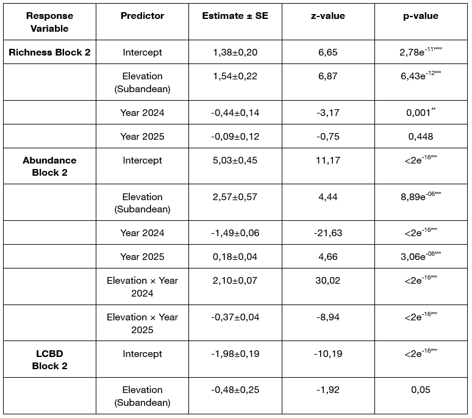

# patagonian-wetlands-analysis

Environmental and multivariate analysis of Patagonian mountain wetlands using R.

## Overview

This project explores the spatial and temporal variability of aquatic macroinvertebrate communities in Patagonian mountain wetlands using physicochemical and environmental data.

The analysis evaluates how altitude, nutrient availability, and interannual climatic variability influence biodiversity patterns across Andean and sub-Andean wetlands.

## Methods

Methods included:

- Environmental and ecological data analysis
- Statistical modeling in R
- Generalized Linear Mixed Models (GLMM)
- Beta diversity analysis (LCBD)

## Tools and packages

- R
- tidyverse
- glmmTMB
- DHARMa
- emmeans
- adespatial

## Repository structure

- `scripts/` → data cleaning, modeling, and visualization script
- `figures/` → selected figures and plots
- `results/` → model outputs and processed results

## Study system

Mountain wetlands from Cordón Esquel, Patagonia, Argentina.

## Example figures

### Environmental predictors of macroinvertebrate richness

Generalized Linear Mixed Models (GLMM) revealed significant relationships between taxonomic richness, elevation, and nutrient concentrations across mountain wetlands.

---

### Spatial and temporal variability in macroinvertebrate abundance

Modeled abundance patterns across Andean and sub-Andean wetlands showed strong interannual variability and significant elevation × year interactions.

## Model outputs

### Environmental summary statistics

Summary of physicochemical variables measured across Andean and sub-Andean wetlands during the 2018, 2024, and 2025 sampling campaigns.

---

### GLMM results — Block 1

Generalized Linear Mixed Models evaluating relationships between taxonomic richness, elevation, and nutrient concentrations.

---

### GLMM results — Block 2

Generalized Linear Mixed Models evaluating spatial and temporal variability in richness, abundance, and local contribution to beta diversity (LCBD).

---

### Local contribution to beta diversity (LCBD)

LCBD analyses highlighted spatial differences in community uniqueness between wetland types.

