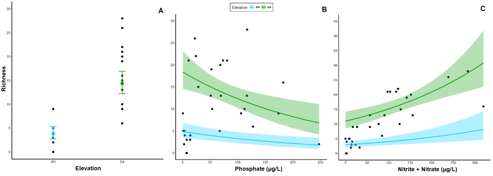
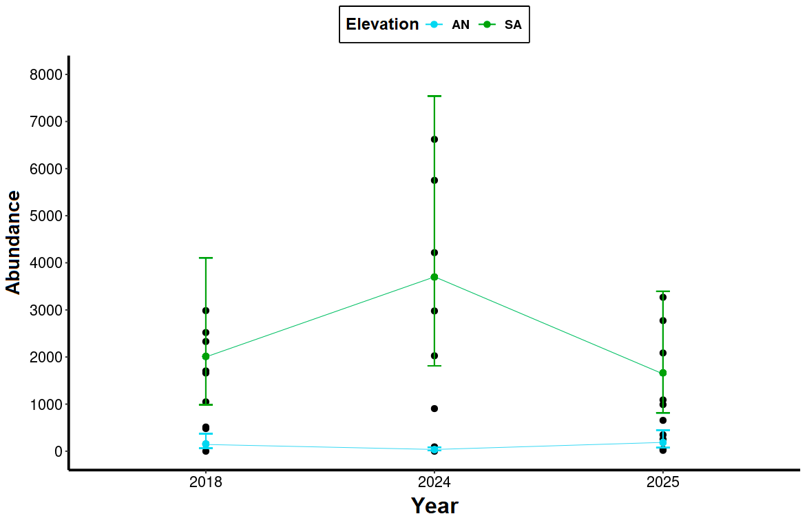
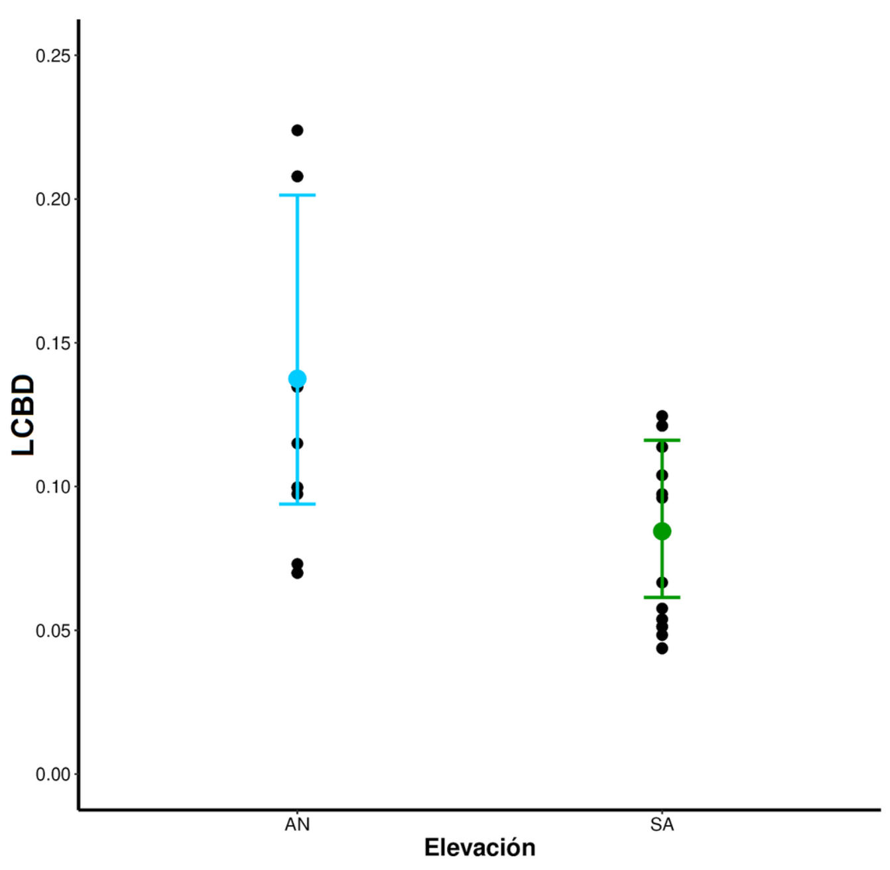
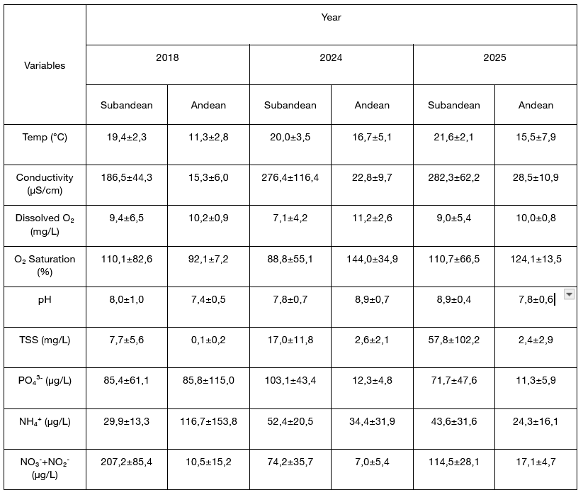
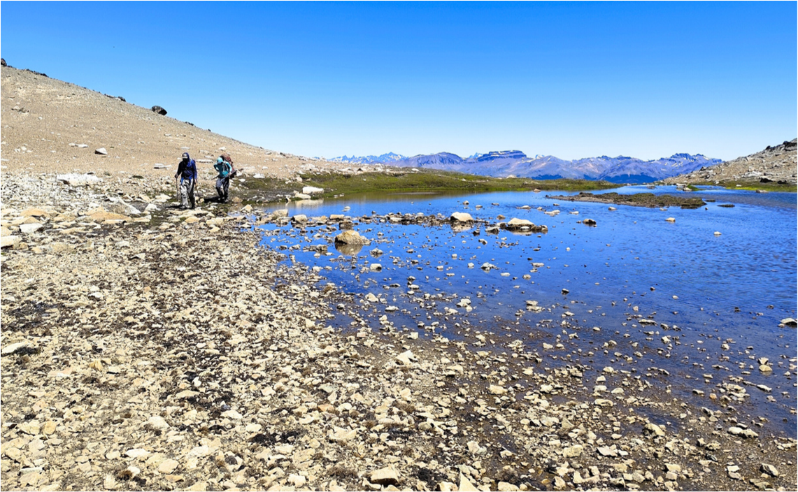
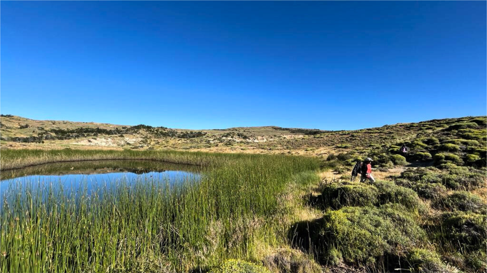
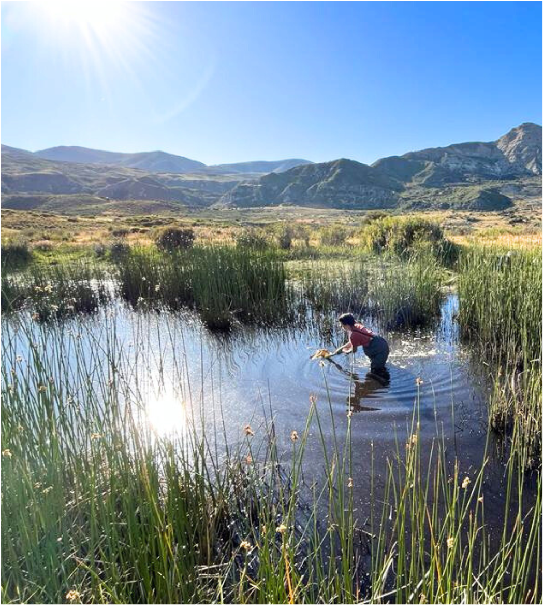

# patagonian-wetlands-analysis

Environmental and multivariate analysis of Patagonian mountain wetlands using R.

## Overview

This project explores the spatial and temporal variability of aquatic macroinvertebrate communities in Patagonian mountain wetlands using physicochemical and environmental data.

The analysis evaluates how altitude, nutrient availability, and interannual climatic variability influence biodiversity patterns across Andean and Subandean wetlands.

## Methods

Methods included:

- Environmental and ecological data analysis
- Statistical modeling in R
- Generalized Linear Mixed Models (GLMM)
- Beta diversity analysis (LCBD)

## Tools and packages

- R
- tidyverse
- glmmTMB
- DHARMa
- emmeans
- adespatial

## Repository structure

- `scripts/` → data cleaning, modeling, and visualization scripts
- `figures/` → selected figures and plots
- `results/` → model outputs and processed results

## Study system

Mountain wetlands from Cordón Esquel, Patagonia, Argentina.

## Example figures

### Environmental predictors of macroinvertebrate richness

Generalized Linear Mixed Models (GLMM) revealed significant relationships between taxonomic richness, elevation, and nutrient concentrations across mountain wetlands.

---

### Spatial and temporal variability in macroinvertebrate abundance

Modeled abundance patterns across Andean and Subandean wetlands showed strong interannual variability and significant elevation × year interactions.

---

### Local contribution to beta diversity (LCBD)

LCBD analyses highlighted spatial differences in community uniqueness between wetland types.

## Model outputs

### Environmental summary statistics

Summary of physicochemical variables measured across Andean and Subandean wetlands during the 2018, 2024, and 2025 sampling campaigns.

---

### GLMM results — Block 1

Generalized Linear Mixed Models evaluating relationships between taxonomic richness, elevation, and nutrient concentrations.

---

### GLMM results — Block 2

Generalized Linear Mixed Models evaluating spatial and temporal variability in richness, abundance, and local contribution to beta diversity (LCBD).

## Key findings

- Mountain wetlands from the Esquel Mountain Range showed clear environmental differentiation along the altitudinal gradient.

- Subandean wetlands exhibited:
  - higher temperatures,
  - higher conductivity,
  - and increased nutrient concentrations.

- Andean wetlands were characterized by:
  - colder waters,
  - lower conductivity,
  - and oligotrophic conditions.

- Taxonomic richness was significantly associated with nutrient availability, particularly phosphate and nitrate/nitrite concentrations.

- Elevation influenced macroinvertebrate community structure, affecting:
  - richness,
  - abundance,
  - and Local Contribution to Beta Diversity (LCBD).

- Interannual climatic variability influenced community dynamics:
  - richness and abundance varied among years,
  - while LCBD remained comparatively stable.

- Results suggest that mountain wetlands are highly sensitive ecosystems where both local physicochemical conditions and large-scale climatic variability shape biological assemblages.

  
  

## Ecological interpretation and conservation relevance

Mountain wetlands from Patagonia function as environmentally heterogeneous and climatically sensitive ecosystems.

This study supports the use of aquatic macroinvertebrates as low-cost ecological indicators capable of detecting environmental variation across elevation and between climatic periods.

The observed interannual variability may be linked to broader climatic oscillations such as ENSO events, which influence regional precipitation dynamics in Patagonia.

These ecosystems are exposed to increasing anthropogenic pressures including:
- water extraction,
- livestock activity,
- off-road vehicle transit,
- tourism,
- and potential mining development.

Because mountain wetlands act as biodiversity reservoirs and freshwater regulation systems, long-term ecological monitoring is essential for conservation and management strategies under climate change scenarios.

  
  

## Skills demonstrated

- Ecological data analysis and statistical modeling in R
- Generalized Linear Mixed Models (GLMM)
- Multivariate ecological analysis
- Environmental data visualization and interpretation
- Long-term ecological monitoring
- Reproducible analytical workflows
- Scientific reporting and communication
- Field campaign planning and logistics coordination
- High-altitude wetland sampling in Patagonia
- Physicochemical and biological sample collection and processing
- Integration of field ecology, laboratory analyses, and quantitative data analysis

  
  

  

